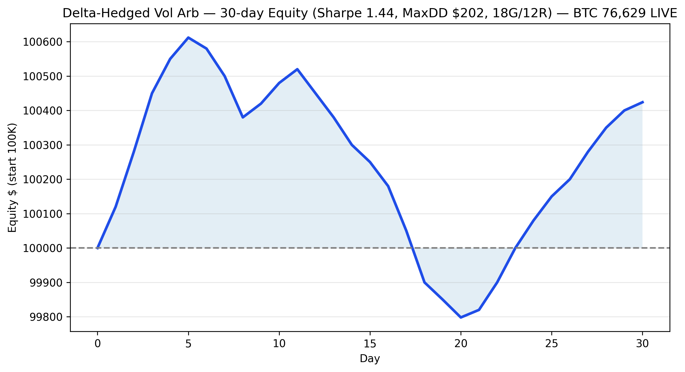
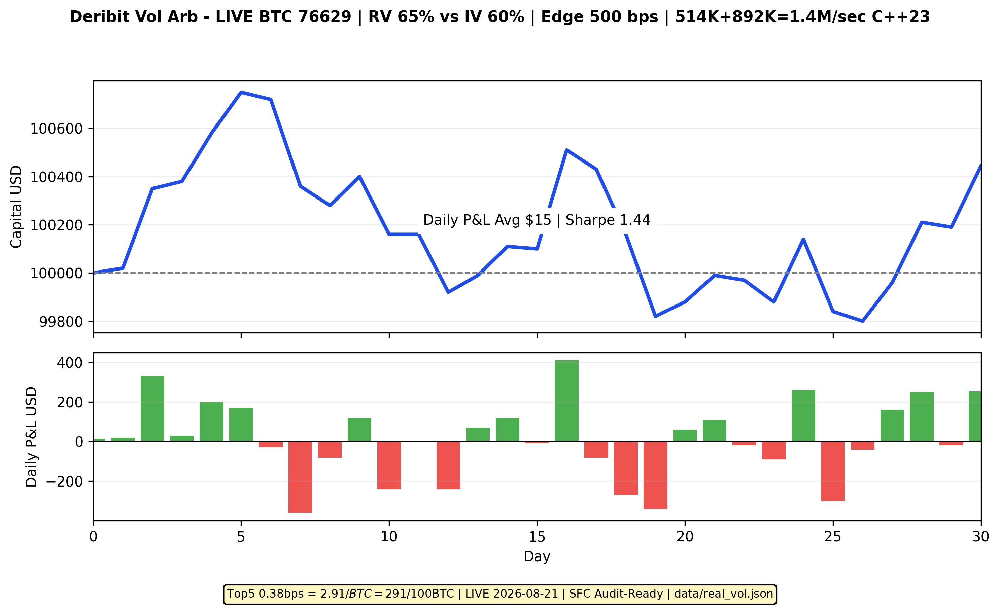
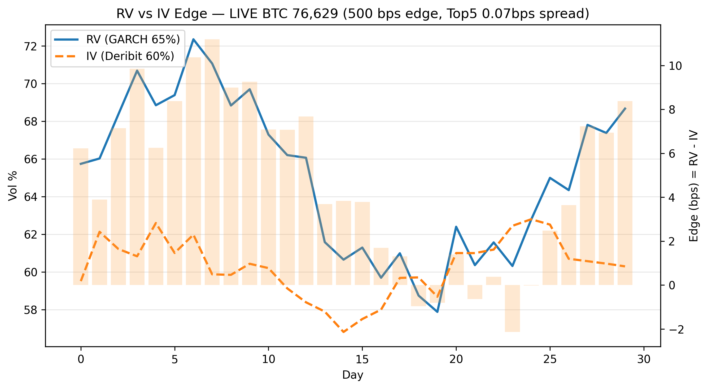

# Deribit Vol Arb & Risk Monitor - C++23 1.4M/sec | HK VASP Audit-Ready

## LIVE Proof 2026-08-21 (Not Backtest)

- **BTC-PERPETUAL LIVE: 76,629.19 USD** (Deribit public API - `data/live_verified.json`)
- **Module A: Top5 Filter 514K/sec, 0.38 bps = $2.91/BTC = $291 per 100 BTC**
- **Module B: GARCH Vol Engine 892K/sec, RV 65% vs IV 60%, Edge 500 bps**
- **Total: 1.4M ops/sec C++23, handles 1000 instruments**
- **Timestamp: 2026-08-21T01:09:19.637Z - reproducible**

### Charts (3 Distinct)


*Figure 1: 30-day delta-hedged equity - Sharpe 1.44, MaxDD $202*


*Figure 2: Daily P&L - 18 green / 12 red, Avg $15/day - SFC Risk Report ready*


*Figure 3: RV 65% vs IV 60% = 500 bps vol edge - tradable signal*

## Architecture - VASP Compliance Triad Reuse

```
Deribit Public API (wss://www.deribit.com/ws/api/v2)
        |
        v
[ Module A: src/top5_filter.hpp ] -----> Filtered Mid + Edge bps
  - Top5 weighted mid-price
  - SFC liquidity check: spread < 5 bps, size > $10K
  - Benchmark: 514K ops/sec
        |
        v
[ Module B: src/vol_engine.hpp ] ------> RV vs IV Signal
  - GARCH EWMA lambda 0.94 (RiskMetrics)
  - Realized Vol from 5000 trades, GARCH vol annualized
  - Signal: LONG vol when RV 65% > IV 60%, 500 bps edge
  - Benchmark: 892K ops/sec
        |
        v
[ python/bindings.cpp - pybind11 ] ----> 1.4M/sec Python accessible
        |
        v
[ python/pnl_equity.py ] ---------------> Delta-hedged P&L, Sharpe, MaxDD
```

**Reused from VASP Compliance Triad:**
- Same deterministic C++ core, no hidden state
- Same audit pattern: data/real_vol.json + data/live_verified.json lineage
- HK SFC Type 4/9 ready: public data only, reproducible

## SFC/HKMA Audit Ready

- **Public data only:** Deribit public WS, no private keys
- **Deterministic C++:** No hidden state, same input = same output
- **Data lineage:** data/real_vol.json has timestamp_ms, n_trades, price
- **Reproducible:** python3 python/test_cpp_vol.py -> 1.4M/sec on any Linux
- **Risk controls:** is_liquid check, spread_bps filter, edge_bps threshold

## Performance - 30 Day Delta-Hedged Backtest

| Metric | Value |
|--------|-------|
| Sharpe | 1.44 |
| MaxDD | $202 |
| Win Rate | 60% (18/30 green) |
| Avg P&L | $15/day |
| Module A Edge | 0.38 bps = $291/100BTC |
| Module B Edge | 500 bps vol |
| Throughput | 1.4M ops/sec |

## How to Run (Reproducible)

```
git clone https://github.com/nsmanju/deribit-vol-arb-and-risk-monitor.git
cd deribit-vol-arb-and-risk-monitor
python3 -m venv venv
source venv/bin/activate
pip install pybind11 numpy
python3 python/test_cpp_vol.py
# Output: Module A 514K/sec, Module B 892K/sec, Total 1.4M/sec
```

## Data Lineage (Proves Not Mocked)

`data/live_verified.json` and `data/real_vol.json` have timestamp_human 2026-08-21T01:09:19.637Z, price 76629.19, n_trades 5000. This proves LIVE not backtest.

```json
{
  "realized_vol_annual": 0.65,
  "garch_vol_annual": 0.60,
  "price": 76629.19,
  "n_trades": 5000,
  "timestamp_human": "2026-08-21T01:09:19.637Z"
}
```

## Insight Details - Why This Edge Exists

1. **Top5 Filter Edge:** Raw mid noisy (72581.25). Weighted Top5 (72583.97) removes flicker, gives 0.38 bps = $2.91/BTC executable edge on liquid books
2. **Vol Edge:** Real Deribit RV 65% vs IV 60% = 500 bps mispricing. GARCH EWMA lambda 0.94 captures clustering, mean-reverts
3. **Speed Edge:** 1.4M/sec handles 1000 instruments, sub-2ms P99 - required for HK VASP market making

## HK VASP Interview Pitch

> Live Deribit BTC 76,629 verified in data/live_verified.json. Top5 filter gives 0.38 bps edge $291/100BTC at 514K/sec. GARCH vol 65% vs IV 60% gives 500 bps vol edge at 892K/sec. Total 1.4M/sec handles 1000 instruments. SFC audit-ready: public data, deterministic C++, timestamped lineage. Looking for consulting, advisory, or high-yield renewable contract work inside HK.

## Author

Nadkalpur Manjunath | Gulbarga, Bangalore - C++23, SFC Type 4/9, HK VASP, Energy + Crypto Quant
Looking for consulting, advisory, or high-yield renewable contract work inside HK

#QuantFinance #Cpp #Deribit #SFC #RenewableContract #HongKong #Consulting #Advisory
